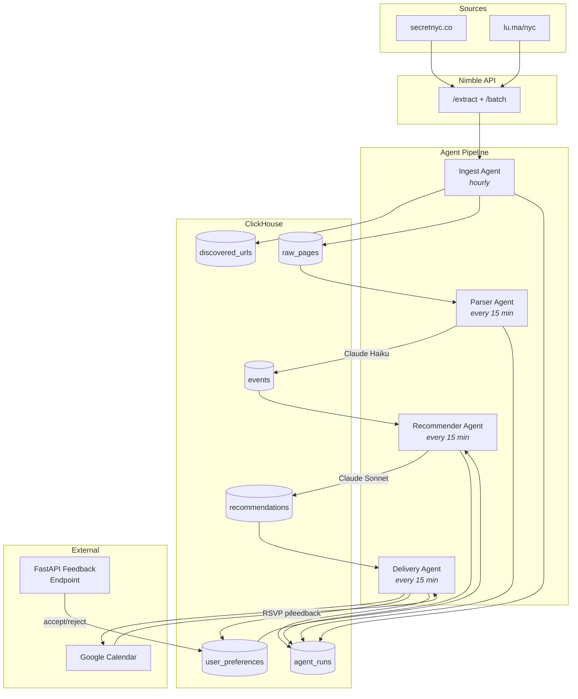
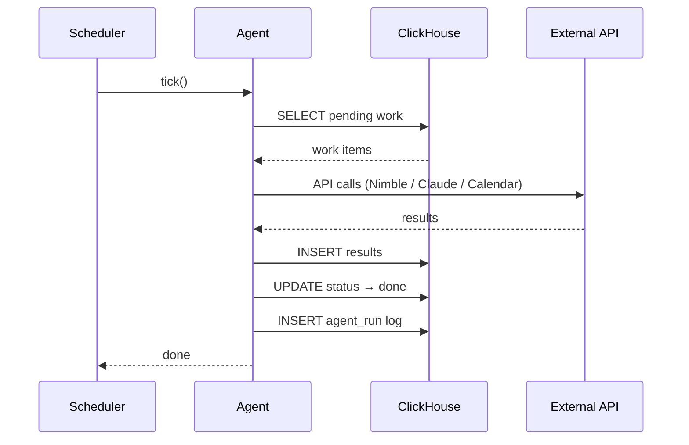
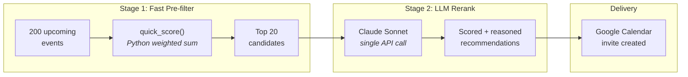
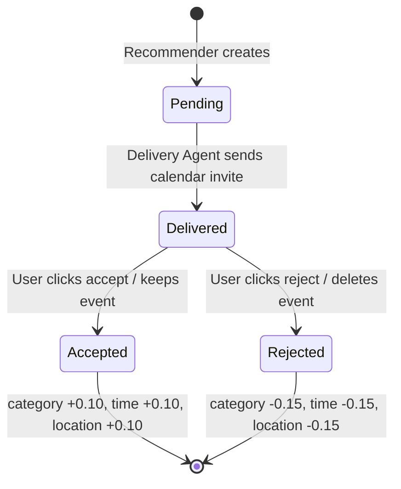
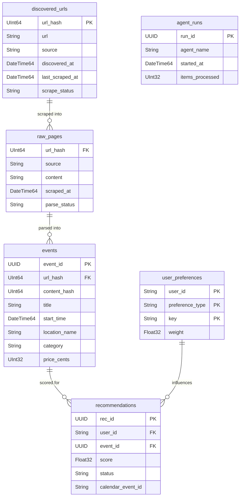

# Event Scheduler

Agentic NYC event scheduler that scrapes event sites, learns your preferences, and creates Google Calendar invites for events you'll actually want to attend.

## Architecture

Four tick-based agents form a pipeline. Each agent loads its work queue from ClickHouse, does one batch of work, writes results back, and exits. No long-running processes — every agent invocation is a short, stateless tick.



## Agent Tick Pattern

Each agent follows the same stateless pattern. No in-memory state survives between ticks — ClickHouse is the single source of truth.



## Recommendation Flow

Two-stage scoring keeps LLM costs low by pre-filtering with cheap Python math before sending only the top candidates to Claude Sonnet for reranking.



## Feedback Loop

User accept/reject signals update preference weights asymmetrically: rejections have a stronger effect (-0.15) than accepts (+0.10) because false positives are more annoying than missed events.



## Data Model



## Project Structure

```
src/event_scheduler/
├── config.py                 # Pydantic Settings (env vars)
├── db.py                     # ClickHouse client + migration runner
├── models.py                 # Pydantic data models
├── migrations/
│   └── 001_initial.sql       # ClickHouse CREATE TABLE statements
├── agents/
│   ├── base.py               # BaseAgent tick pattern
│   ├── ingest.py             # Discover + scrape + dedup (Nimble API)
│   ├── parser.py             # Raw HTML → structured events (Claude Haiku)
│   ├── recommender.py        # Two-stage score + rerank (Claude Sonnet)
│   └── delivery.py           # Calendar invite + RSVP poll + feedback
├── services/
│   ├── nimble.py             # Nimble API wrapper
│   ├── llm.py                # Anthropic client (parse + rerank)
│   ├── calendar.py           # Google Calendar API wrapper
│   └── preferences.py        # Preference weight CRUD + scoring
├── scheduler.py              # APScheduler entry point
├── api.py                    # FastAPI feedback endpoint
└── scripts/
    ├── run_agent.py           # Run one agent tick manually
    └── seed_preferences.py    # Bootstrap user preferences
```

## Tech Stack

| Component | Technology | Purpose |
|-----------|-----------|---------|
| Web scraping | [Nimble API](https://nimbleway.com) | Extract event data from secretnyc, luma |
| Storage | [ClickHouse](https://clickhouse.com) | All persistent state — events, preferences, recommendations |
| Event parsing | Claude Haiku | Structured extraction from raw HTML |
| Recommendation | Claude Sonnet | Rerank candidates with reasoning |
| Calendar | Google Calendar API | Create invites, detect accept/reject |
| Feedback | FastAPI | Accept/reject webhook endpoint |
| Scheduling | APScheduler | Run agents on cadences |
| Config | Pydantic Settings | Type-safe env var loading |

## Setup

```bash
# Install dependencies
uv sync

# Copy and fill in API keys
cp .env.example .env
# Edit .env with your keys

# Run ClickHouse migrations
uv run run-agent ingest --migrate

# Seed your preferences
uv run seed-prefs

# Start the agent scheduler
uv run event-scheduler

# In another terminal, start the feedback API
uv run event-api
```

## Running a Single Agent

```bash
uv run run-agent ingest       # Discover + scrape events
uv run run-agent parser       # Parse raw pages into structured events
uv run run-agent recommender  # Score and recommend events
uv run run-agent delivery     # Send calendar invites + poll RSVPs
```

## Cost Estimate (daily)

| Component | Cost |
|-----------|------|
| Nimble API | ~$5-15 (dominant) |
| Claude Haiku (parsing) | ~$0.05 |
| Claude Sonnet (rerank) | ~$0.10 |
| ClickHouse | Free tier / self-hosted |
| Google Calendar API | Free |
| **Total** | **~$5-15/day** |
