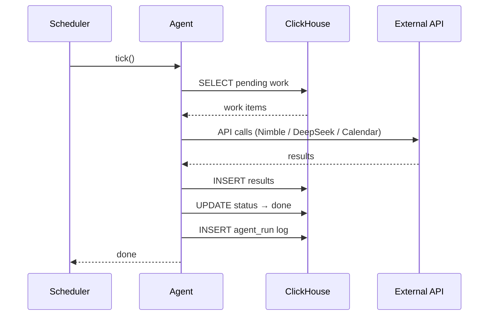
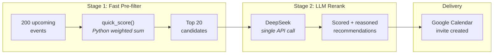
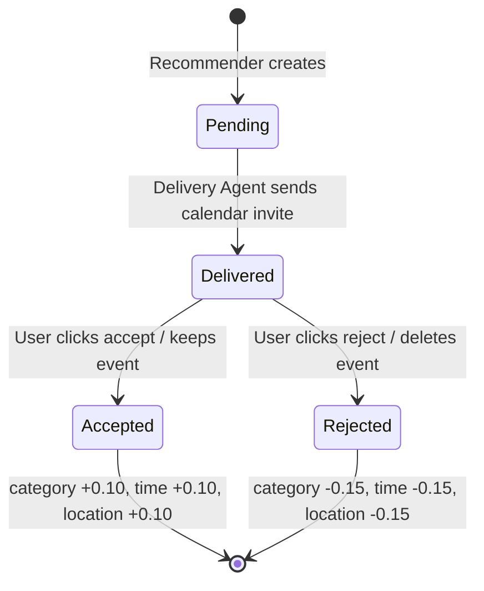
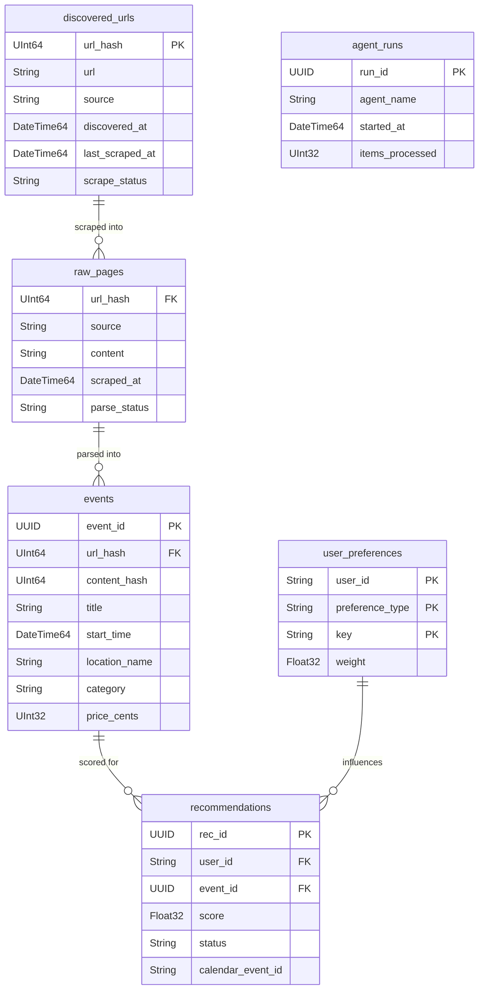

# Event Scheduler

Agentic NYC event scheduler that scrapes event sites, learns your preferences, and creates Google Calendar invites for events you'll actually want to attend.

## Architecture

Four tick-based agents form a pipeline. Each agent loads its work queue from ClickHouse, does one batch of work, writes results back, and exits. No long-running processes — every agent invocation is a short, stateless tick.


## Agent Tick Pattern

Each agent follows the same stateless pattern. No in-memory state survives between ticks — ClickHouse is the single source of truth.



## Recommendation Flow

Two-stage scoring keeps LLM costs low by pre-filtering with cheap Python math before sending only the top candidates to DeepSeek for reranking.



## Feedback Loop

User accept/reject signals update preference weights asymmetrically: rejections have a stronger effect (-0.15) than accepts (+0.10) because false positives are more annoying than missed events.



## Data Model



## Project Structure

```
src/event_scheduler/
├── config.py                 # Pydantic Settings (env vars)
├── db.py                     # ClickHouse client + migration runner
├── models.py                 # Pydantic data models
├── migrations/
│   └── 001_initial.sql       # ClickHouse CREATE TABLE statements
├── agents/
│   ├── base.py               # BaseAgent tick pattern
│   ├── ingest.py             # Discover + scrape + dedup (Nimble API)
│   ├── parser.py             # Raw HTML → structured events (DeepSeek)
│   ├── recommender.py        # Two-stage score + rerank (DeepSeek)
│   └── delivery.py           # Calendar invite + RSVP poll + feedback
├── services/
│   ├── nimble.py             # Nimble API wrapper
│   ├── llm.py                # OpenAI-compatible DeepSeek client (parse + rerank)
│   ├── calendar.py           # Google Calendar API wrapper
│   └── preferences.py        # Preference weight CRUD + scoring
├── scheduler.py              # APScheduler entry point
├── api.py                    # FastAPI feedback endpoint
└── scripts/
    ├── run_agent.py           # Run one agent tick manually
    └── seed_preferences.py    # Bootstrap user preferences
```

## Tech Stack

| Component | Technology | Purpose |
|-----------|-----------|---------|
| Web scraping | [Nimble API](https://nimbleway.com) | Extract event data from secretnyc, luma |
| Storage | [ClickHouse](https://clickhouse.com) | All persistent state — events, preferences, recommendations |
| Event parsing | DeepSeek (via OpenAI-compatible gateway) | Structured extraction from raw HTML |
| Recommendation | DeepSeek (via OpenAI-compatible gateway) | Rerank candidates with reasoning |
| Calendar | Google Calendar API | Create invites, detect accept/reject |
| Feedback | FastAPI | Accept/reject webhook endpoint |
| Scheduling | APScheduler | Run agents on cadences |
| Config | Pydantic Settings | Type-safe env var loading |

## Setup

```bash
# Install dependencies
uv sync

# Copy and fill in API keys
cp .env.example .env
# Edit .env with your keys: NIMBLE_API_KEY, CLICKHOUSE_*, LLM_*, GOOGLE_*

# Run ClickHouse migrations
uv run run-agent ingest --migrate

# Seed your preferences (interactive — rates categories, time slots, boroughs)
uv run seed-prefs
```

If `uv` isn't on your `PATH` (e.g. Windows Store Python), substitute `python -m uv` for `uv` in any of the commands below.

## Running the App

There are two ways to drive the pipeline. Pick **one** — running both at the same time will double up calendar invites.

### Option A — Flask control panel (recommended)

A small web UI lets you type who you are + what you want to see, and kicks off the full pipeline on a 2-minute loop. The page polls itself for updates, so invites and picks appear without manual refresh.

**One-time:** capture a Google OAuth refresh token so the delivery agent can write to your calendar. Follow the steps printed by the script (set up an OAuth client in Google Cloud Console first):

```bash
uv run oauth-setup
```

Then start the app:

```bash
uv run event-web    # http://127.0.0.1:5050
uv run event-api    # in another terminal — :8000, powers accept/reject links in invites
```

On the page:

- **Name / tag** — any short identifier. This is your `user_id`, the partition key for your preferences and recommendations in ClickHouse.
- **Calendar email** — the Google Calendar id that invites land on. Must be an account the OAuth user can write to (your own gmail is the common case).
- **Vibe** — free-text ask ("low-key weeknight art in Brooklyn, free or cheap"). Becomes the dominant signal for the LLM rerank — overrides stored preference weights when they conflict.

After Go, the pipeline (`ingest → parser → recommender → delivery`) runs immediately and every 2 minutes after. You'll see three live cards on the page:

- **What's happening** — current loop state, the active ask, next run timestamp.
- **Your picks** — the actual events the recommender chose, with score, reasoning, and delivery status (pending / delivered / accepted / rejected). Clicking the title opens the source URL.
- **Recent runs** — per-agent results from each tick (`ok (3)` or `err: …`) so you can tell whether each step is healthy.

### Option B — original cron-style scheduler

The CLI scheduler is the older driver — runs each agent on its own cadence (ingest: 1h, others: 15m) and uses `user_id="default"`. Use this if you don't want a UI.

```bash
uv run event-scheduler    # blocks; Ctrl-C to stop
uv run event-api          # in another terminal
```

### Running a single agent manually

Useful for debugging — runs one tick of one agent and exits.

```bash
uv run run-agent ingest       # Discover + scrape events
uv run run-agent parser       # Parse raw pages into structured events
uv run run-agent recommender  # Score and recommend events
uv run run-agent delivery     # Send calendar invites + poll RSVPs
```

## Cost Estimate (daily)

| Component | Cost |
|-----------|------|
| Nimble API | ~$5-15 (dominant) |
| DeepSeek (parsing) | ~$0.05 |
| DeepSeek (rerank) | ~$0.10 |
| ClickHouse | Free tier / self-hosted |
| Google Calendar API | Free |
| **Total** | **~$5-15/day** |
